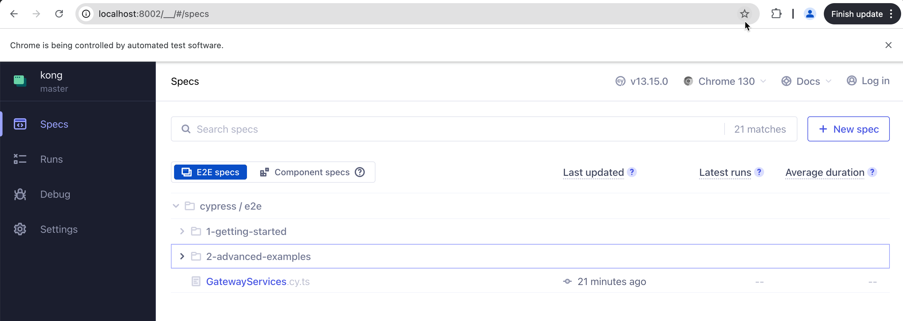
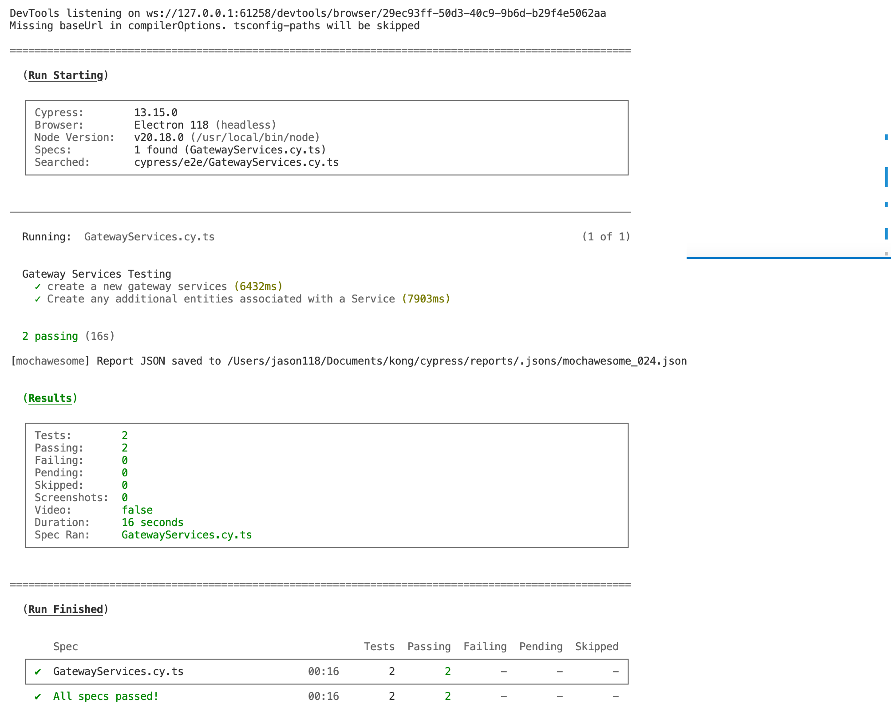

# Steps for Home assignment ( notes: Local machine is MacOS)

### Setup local Kong Manager:
- Install Docker Desktop (Mac version)
- Create containers for Kong Manager using docker-compose.yml, the command is `docker-compose up -d`
- Open the Kong Manager UI using URL: `http://localhost:8002/`


### Setup Cypress Typescript testing environment
- Precondition: install latest stable node and npm.
- Create a new project named "kong".
- Initial the package.json using command `npm init -y`
- Install the required node packages using command `npm install`
- Install Cypress and Typescript using command `npm install cypress typescript @types/node --save-dev`
- Install the type declaration files for Cypress using command `npm install @types/cypress --save-dev`
- Create tsconfig.json file, set the script path in it.
- Init the Cypress using command `npx cypress open`, the cypress Runner page will open as below:


### Create Cypress scripts 
- The script is in cypress/e2e/GatewayServices.cy.ts
- Run the test using command `npx cypress run --spec "cypress/e2e/GatewayServices.cy.ts"`


### Test Result Reporting
- Install the dependencies for "Mochawesome" using command `npm install --save-dev cypress-mochawesome-reporter`
- Configure for the plugin in file "cypress.config.ts" as below:
```Typescript
const { defineConfig } = require("cypress");

module.exports = defineConfig({
  reporter: 'cypress-mochawesome-reporter',
  reporterOptions: {
    reportDir: 'cypress/reports',
    overwrite: false,
    html: true,
    json: true
  },
  e2e: {
    setupNodeEvents(on, config) {
      require('cypress-mochawesome-reporter/plugin')(on);
    },
  },
});
```

- Run the test again. The results as below in console and there will be the results details in file `cypress/reports`



### Shut down docker services using command  `docker-compose down`
